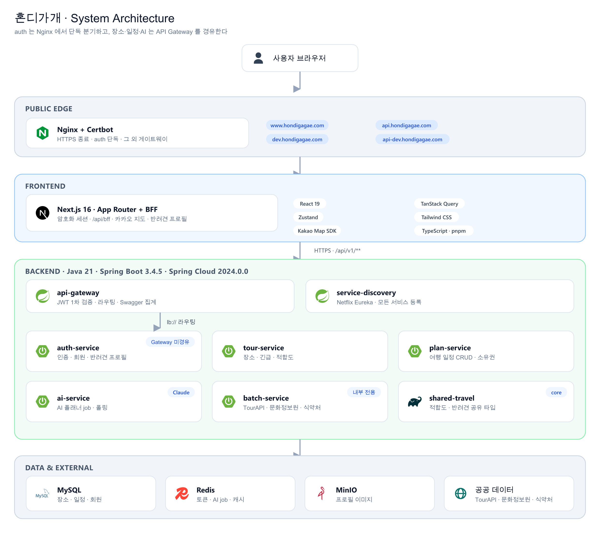
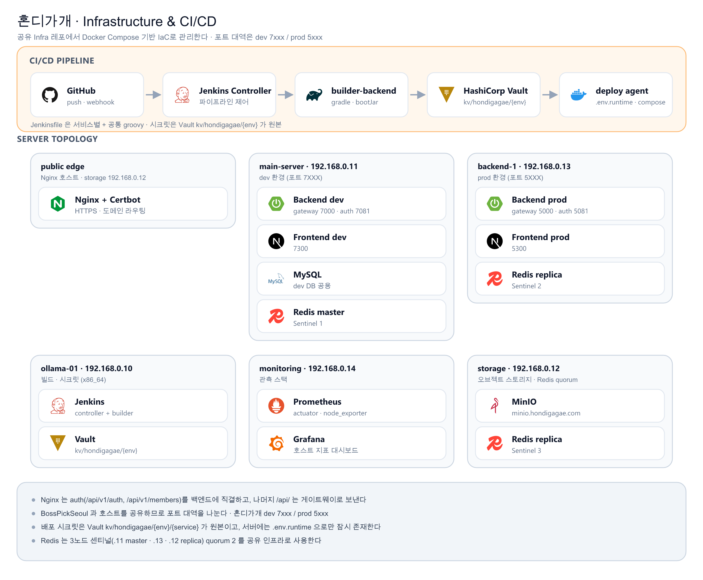

# 혼디가개 (hondigagae)

> 관광 데이터를 기반으로 반려견 맞춤 여행을 설계하고, 최적의 여행 의사결정을 지원하는 AI 기반 스마트 관광 서비스
>
> 일정과 반려견 특성을 넣으면 **동반 가능한 장소로 코스를 짜고**, 날씨·혼잡·긴급 시설까지 묶어 “지금 가도 되는지”를 판단하도록 돕습니다. (2026 관광데이터 활용 공모전)

| 항목 | 내용 |
| --- | --- |
| 프로젝트명 | 혼디가개 (hondigagae) |
| 한 줄 소개 | 반려견 맞춤 여행 설계 · 의사결정 지원 스마트 관광 서비스 |
| 출품 | 2026 관광데이터 활용 공모전 |
| 개발 기간 | 2026.08 ~ 진행 중 |
| 대상 지역 | 제주 (1차). 장소 마스터는 공공데이터로 적재 |
| 타겟 | 반려견과 함께 여행하려는 보호자, 동반 가능 여부와 이동 부담을 먼저 보고 싶은 사용자 |
| 도메인 | `www.hondigagae.com` (웹) · `api.hondigagae.com` (운영 API) · `dev.hondigagae.com` · `api-dev.hondigagae.com` |

## 설계 포인트

- **MSA**: Eureka + Spring Cloud Gateway 기반으로 인증 / 관광 / 일정 / AI / 배치 서비스 분리
- **Hexagonal Architecture**: `Controller → WebUseCase → WebFacade → Processor → Port/Adapter` 계층 규약을 전 서비스에 통일
- **Next.js App Router + BFF**: 브라우저는 백엔드를 직접 부르지 않고 `/api/bff`를 경유한다
- **반려견 중심 도메인**: 회원과 별도로 `pet` 프로필(크기·성향·민감도)을 두고, 장소 검색·일정·AI 제안에 조건을 넘긴다
- **공공데이터 선적재**: TourAPI · 문화정보원 · 식약처 음식점을 배치로 MySQL에 합친 뒤 서비스는 DB만 조회. 서버는 카카오 로컬을 호출하지 않는다
- **IaC 공유 인프라**: Jenkins · Vault · Nginx · Redis Sentinel · MinIO · Prometheus/Grafana를 [별도 Infra 레포](#인프라-구성)에서 코드로 관리. 포트 대역은 **dev `7xxx` / prod `5xxx`** (BossPickSeoul `6xxx`/`9xxx`와 호스트 공유)

## 주요 기능

| 영역 | 기능 |
| --- | --- |
| 회원 | 이메일 인증 회원가입·로그인, 카카오/네이버 소셜 로그인, 프로필·이미지·비밀번호·탈퇴 |
| 반려견 프로필 | 견종·크기·활동 성향·환경 민감도 CRUD (`/api/v1/members/me/pets`) |
| 장소 탐색 | 지역·타입·동반 조건 필터, 커서 목록, 좌표 반경 검색, 상세(소개·동반정보·이미지) |
| 여행 적합도 | 날씨·동반조건·혼잡도 점수 + 이유, 산책 위험도(추정 노면온도·열지수)와 안전 시간대 |
| 긴급 시설 | 현재 위치 기준 동물병원·동물약국 반경 검색 (제주 214곳) |
| 여행 일정 | 일정 CRUD, 일자별 항목 일괄 교체, 일자별 날씨 브리핑 + 비 오는 날 실내 대안. **소유권은 plan-service**. AI는 제안만 |
| AI 플래너 | 조건 제출 → 202 + `jobId` → 폴링. 기본은 Stub, `ai-llm.enabled` 시 Anthropic Claude. 후보 장소 목록으로 환각 차단 |
| 공공데이터 적재 | TourAPI 장소, 문화정보원 시설·긴급, 식약처 음식점 + VWorld 지오코딩, 관광지 집중률 예측 |

> 제주 장소 마스터는 관광 29 + 문화정보원 228 + 식약처 102 − 중복 ≈ **315곳**, 긴급 시설 **214곳** 규모로 설계되어 있습니다. 두루누비 산책 코스는 아직 미착수입니다.

## 시스템 아키텍처

### 전체 구성



**핵심 흐름**

- 브라우저는 백엔드를 직접 호출하지 않습니다. 웹 요청은 Next.js BFF(`/api/bff`)를 거칩니다. 엣지에서 `auth-service`는 Nginx가 `/api/v1/auth`, `/api/v1/members`로 직결하고, 장소·일정·AI는 게이트웨이가 JWT를 1차 검증한 뒤 Eureka `lb://`로 라우팅합니다. Swagger는 게이트웨이가 4개 서비스 문서를 집계합니다.
- 일정의 저장·확정은 `plan-service`만 합니다. 장소 항목은 Feign으로 `tour-service` 존재를 검증합니다. `ai-service`는 Redis 작업 + 워커로 제안을 만들고, 확정은 클라이언트가 plan API로 올립니다.
- 공공 API는 쿼터를 피하려고 배치가 DB에 적재합니다. 날씨는 기상청 실시간 + Redis 캐시, 혼잡은 `congestionImportJob` 주기 적재입니다.

### 백엔드 모듈

| 구분 | 모듈 | 책임 | 내부 포트 |
| --- | --- | --- | --- |
| cloud | `service-discovery` | Eureka 서비스 레지스트리 | 8761 |
| cloud | `api-gateway` | 라우팅, JWT 1차 검증, CORS, Swagger 집계 | 8000 |
| service | `auth-service` | 인증, 회원, 소셜 로그인, 반려견 프로필 | 8081 |
| service | `tour-service` | 장소 검색·상세, 긴급 시설, 여행 적합도·산책 안전 | 8082 |
| service | `plan-service` | 여행 일정 CRUD, 일자 항목, 날씨 브리핑 | 8083 |
| service | `ai-service` | AI 일정 제안 (비동기 job + 폴링, Claude / Stub) | 8085 |
| service | `batch-service` | 공공데이터 일괄 적재 (Spring Batch) | 8080 |
| core | `common-core` / `persistence-core` / `redis-core` / `security-core` / `storage-core` / `shared-travel` | 공통 응답·Swagger·Jasypt, JPA·QueryDSL·Snowflake, Redis, JWT, MinIO, 여행 공유 타입 | — |

계층 규약은 서비스 전반에 동일하게 적용됩니다.

```
Controller → WebUseCase → WebFacade → Processor → Port → Adapter
                              ↘ Presenter (Info → Response 변환 전담)
```

배치 잡은 기동 시 자동 실행하지 않습니다(`spring.batch.job.enabled=false`). 잡을 지정해 돌립니다.

| 잡 | 적재 대상 | 원천 |
| --- | --- | --- |
| `placeImportJob` | 제주 관광 장소 | TourAPI (`areaCode` 기본 39) |
| `cultureFacilityImportJob` | 문화시설 + 긴급 시설 | 한국문화정보원 CSV |
| `petRestaurantImportJob` | 반려견 동반 음식점 | 식약처 + VWorld 지오코딩 |
| `congestionImportJob` | 관광지 집중률 예측 + 명칭 매칭 | 관광빅데이터 (장소 적재 이후) |

### 인프라 구성

인프라는 별도 IaC 레포(`Infra`)에서 Docker Compose + 셸 스크립트로 관리합니다. BossPickSeoul · TripMarble과 호스트를 공유합니다.



| 영역 | 구성 |
| --- | --- |
| 리버스 프록시 | Nginx + Certbot, HTTP→HTTPS, auth 직결 + 게이트웨이 분기, AI SSE 버퍼링 해제 예약 |
| 시크릿 | HashiCorp Vault KV v2, `kv/hondigagae/{env}/{service}` · 배포 시 `.env.runtime`만 생성 |
| 캐시/세션 | Redis master 1 + replica 2 + Sentinel 3 (quorum 2) |
| 오브젝트 스토리지 | MinIO (`minio.hondigagae.com`, 프로필 이미지) |
| 관측 | Prometheus + Grafana + node_exporter (애플리케이션 actuator) |

| 대상 | 환경 | 호스트 | 포트 대역 | 도메인 |
| --- | --- | --- | --- | --- |
| 백엔드 게이트웨이 | dev | `192.168.0.11` | 7000 | `api-dev.hondigagae.com` |
| 백엔드 auth (단독) | dev | `192.168.0.11` | 7081 | `api-dev.hondigagae.com` |
| 프론트 웹 | dev | `192.168.0.11` | 7300 | `dev.hondigagae.com` |
| 백엔드 게이트웨이 | prod | `192.168.0.13` | 5000 | `api.hondigagae.com` |
| 백엔드 auth (단독) | prod | `192.168.0.13` | 5081 | `api.hondigagae.com` |
| 프론트 웹 | prod | `192.168.0.13` | 5300 | `www.hondigagae.com` |

### CI/CD

- 파이프라인 흐름은 위 인프라 구성도 상단 밴드에 정리되어 있습니다.
- Jenkins 노드는 역할+환경 라벨을 씁니다 (`build-backend`, `deploy-backend-dev`, `deploy-backend-prod`).
- 서비스별 `Jenkinsfile-{service}`가 공통 groovy(`Jenkinsfile.backend-common.groovy`, `Jenkinsfile.frontend-common.groovy`)를 재사용합니다.
- 시크릿은 Vault가 원본이고, 배포 서버에는 `.env.runtime`으로만 잠시 존재합니다.

## 기술 스택

| 영역 | 스택 |
| --- | --- |
| Frontend | Next.js 16 (App Router), React 19, TypeScript, TanStack Query, Zustand, Tailwind CSS, 카카오 지도 SDK, Vitest, pnpm |
| Backend | Java 21, Spring Boot 3.4.5, Spring Cloud 2024.0.0 (Gateway · Eureka · OpenFeign), Spring Security / OAuth2 Resource Server, Spring Data JPA, QueryDSL, MapStruct, Spring Batch |
| Data | MySQL, Redis (Sentinel), MinIO |
| AI | Anthropic Claude (`AiLlmPort`, 기본 Stub) · 비동기 job + 폴링 |
| Infra | Docker Compose, Nginx, Certbot, HashiCorp Vault, Jenkins, Prometheus, Grafana |
| 기타 | Resilience4j, Jasypt, Snowflake ID, SpringDoc OpenAPI |

## 저장소 구조

```
hondigagae/
├── backend/                  # Spring Boot 멀티모듈 (core / cloud / service)
│   ├── core/                 # common · persistence · redis · security · storage · shared-travel
│   ├── cloud/                # api-gateway · service-discovery
│   ├── service/              # auth · tour · plan · ai · batch
│   └── docs/                 # 아키텍처 · API · 데이터 · 배포 · 관측 가이드
├── frontend/                 # Next.js 16 App Router + BFF
│   └── docs/                 # 화면 인벤토리 · API 연동 · 인증 가이드
├── Jenkinsfile-*             # 서비스별 파이프라인 + 공통 groovy
└── docs/                     # 아키텍처 다이어그램(images) 및 생성기(diagrams)
```

아키텍처 다이어그램은 손으로 그린 이미지가 아니라 `docs/diagrams/generate-diagrams.mjs`가 생성합니다. 구성이 바뀌면 스크립트를 수정한 뒤 다시 실행해 `docs/images/*.png`를 갱신합니다.

```bash
cd docs/diagrams && npm install && npm run build
```

## 문서

- 백엔드: [문서 인덱스](backend/docs/README.md) · [기능 현황](backend/docs/feature-status.md) · [아키텍처 가이드](backend/docs/architecture-guide.md) · [API 설계 가이드](backend/docs/api-design-guide.md) · [서비스 인벤토리](backend/docs/service-inventory.md)
- 데이터: [장소 데이터 통합](backend/docs/place-data-integration.md) · [외부 API](backend/docs/external-api-guide.md) · [엔티티 설계](backend/docs/entity-design.md) · [데이터 최신화](backend/docs/data-refresh-guide.md)
- 운영: [로컬 실행](backend/docs/local-run-guide.md) · [배포 가이드](backend/docs/deploy-guide.md) · [Jenkins CI/CD](backend/docs/jenkins-cicd-dev-deploy-guide.md) · [관측 가이드](backend/docs/observability-guide.md)
- 프론트엔드: [frontend README](frontend/README.md) · [화면 인벤토리](frontend/docs/screen-inventory.md)
