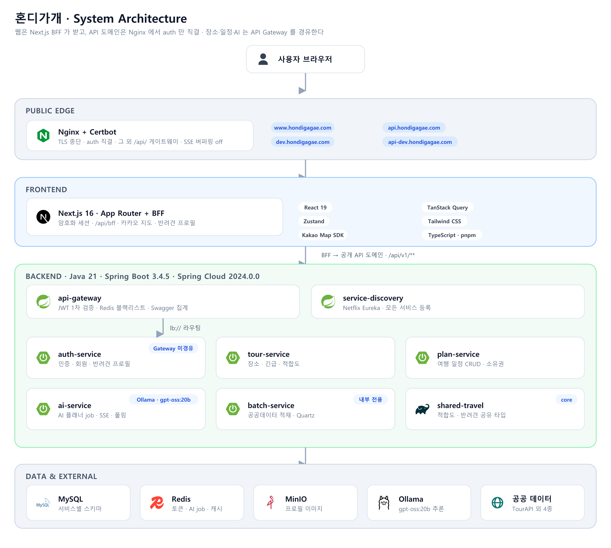
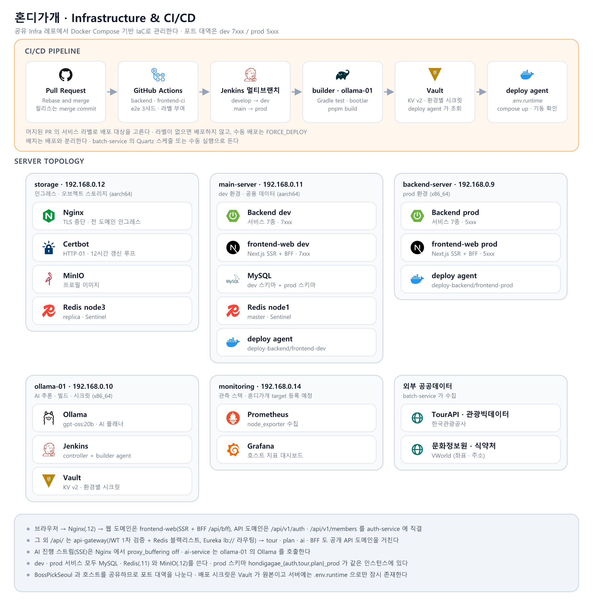

# 혼디가개 (hondigagae)

> 관광 데이터를 기반으로 반려견 맞춤 여행을 설계하고, 최적의 여행 의사결정을 지원하는 AI 기반 스마트 관광 서비스
>
> 일정과 반려견 특성을 넣으면 **동반 가능한 장소로 코스를 짜고**, 날씨·혼잡·긴급 시설까지 묶어 “지금 가도 되는지”를 판단하도록 돕습니다. (2026 관광데이터 활용 공모전)

| 항목 | 내용 |
| --- | --- |
| 프로젝트명 | 혼디가개 (hondigagae) |
| 한 줄 소개 | 반려견 맞춤 여행 설계 · 의사결정 지원 스마트 관광 서비스 |
| 출품 | 2026 관광데이터 활용 공모전 |
| 개발 기간 | 2026.08 ~ 진행 중 |
| 대상 지역 | 제주 (1차). 장소 마스터는 공공데이터로 적재 |
| 타겟 | 반려견과 함께 여행하려는 보호자, 동반 가능 여부와 이동 부담을 먼저 보고 싶은 사용자 |
| 도메인 | `www.hondigagae.com` (웹) · `api.hondigagae.com` (운영 API) · `dev.hondigagae.com` · `api-dev.hondigagae.com` |

## 설계 포인트

- **MSA**: Eureka + Spring Cloud Gateway 기반으로 인증 / 관광 / 일정 / AI / 배치 서비스 분리
- **Hexagonal Architecture**: `Controller → WebUseCase → WebFacade → Processor → Port/Adapter` 계층 규약을 전 서비스에 통일
- **Next.js App Router + BFF**: 브라우저는 백엔드를 직접 부르지 않고 `/api/bff`를 경유한다
- **반려견 중심 도메인**: 회원과 별도로 `pet` 프로필(크기·성향·민감도)을 두고, 장소 검색·일정·AI 제안에 조건을 넘긴다
- **공공데이터 선적재**: TourAPI · 문화정보원 · 식약처 음식점을 배치로 MySQL에 합친 뒤 서비스는 DB만 조회. 서버는 카카오 로컬을 호출하지 않는다
- **IaC 공유 인프라**: Jenkins · Vault · Nginx · Redis · MinIO · Ollama · Prometheus/Grafana를 [별도 Infra 레포](#인프라-구성)에서 Docker Compose로 관리. 포트 대역은 **dev `7xxx` / prod `5xxx`** — 다른 프로젝트와 호스트를 함께 쓰므로 대역을 전체에서 겹치지 않게 잡는다
- **로컬 LLM**: 외부 LLM API 없이 사내 GPU 호스트의 Ollama(`gpt-oss:20b`)로 AI 일정을 만든다. 후보 장소를 서버가 권역별로 골라 주고, 결과를 서버 사실(좌표 · 동반 조건)로 다시 검증한다

## 주요 기능

> 화면 캡처와 GIF로 보는 기능 소개는 **[docs/FEATURES.md](docs/FEATURES.md)** 에 있습니다.

| 영역 | 기능 |
| --- | --- |
| 회원 | 이메일 인증 회원가입·로그인, 카카오/네이버 소셜 로그인, 프로필·이미지·비밀번호·탈퇴, 로그인 세션 관리 |
| 반려견 프로필 | 견종·크기·체중·활동 성향·환경 민감도, 대표견. 장소 필터 · 적합도 · AI 일정이 이 프로필을 조건으로 쓴다 |
| 장소 탐색 | 지역·유형·동반 조건 필터, 커서 목록, 카카오 지도 보기(현재 위치 · 이 지역 재검색 · 병원·약국 함께 보기), 상세(사진·동반 정보·찜) |
| 여행 적합도 | 날씨·동반 조건·혼잡도를 묶은 등급과 근거, 산책 위험도(추정 노면 온도·체감온도), 산책 골든타임, 권역 날씨 비교, 기상특보 |
| 긴급 시설 | 현재 위치·권역 기준 동물병원·동물약국 검색, 지금 진료 중 · 24시간 필터 (제주 214곳) |
| 제주올레 | 올레 29개 코스 목록·상세, 코스 시작점 지도, 오늘 산책하기 좋은 시간, 일정에 담기 |
| 여행 일정 | 일정 만들기·편집·확정, 일자별 타임라인, 이동·휴식 추가, 날씨 브리핑 + 비 오는 날 실내 대안, 공유 링크, 준비물 체크리스트. **소유권은 plan-service**, AI는 제안만 |
| AI 플래너 | 조건 제출 → 202 + `jobId` → SSE/폴링으로 단계 진행 표시 → 초안을 일정으로 담기. 하루 다시 만들기, AI 준비물 추천 |
| 공공데이터 적재 | TourAPI 장소, 문화정보원 시설·긴급, 식약처 음식점 + VWorld 지오코딩, 관광지 집중률 예측, 제주올레 코스. 원천 간 같은 장소 병합 |

> 제주 장소 마스터는 관광 29 + 문화정보원 228 + 식약처 102 − 중복 ≈ **315곳**, 긴급 시설 **214곳** 규모로 설계되어 있습니다. 산책 코스는 **제주올레 29개**(공공데이터포털 올레코스현황 + TourAPI 좌표 결합)를 씁니다 — 두루누비는 걷기 코스에 제주가 없어 쓰지 않습니다.

## 시스템 아키텍처

### 전체 구성



**핵심 흐름**

- 브라우저는 백엔드를 직접 호출하지 않습니다. 웹 요청은 Next.js BFF(`/api/bff`)를 거칩니다. 엣지에서 `auth-service`는 Nginx가 `/api/v1/auth`, `/api/v1/members`로 직결하고, 장소·일정·AI는 게이트웨이가 JWT를 1차 검증한 뒤 Eureka `lb://`로 라우팅합니다. Swagger는 게이트웨이가 4개 서비스 문서를 집계합니다.
- 일정의 저장·확정은 `plan-service`만 합니다. 장소 항목은 Feign으로 `tour-service` 존재를 검증합니다. `ai-service`는 Redis 작업 + 워커로 제안을 만들고, 확정은 클라이언트가 plan API로 올립니다.
- 공공 API는 쿼터를 피하려고 배치가 DB에 적재합니다. 날씨는 기상청 실시간 + Redis 캐시, 혼잡은 `congestionImportJob` 주기 적재입니다.

### 백엔드 모듈

| 구분 | 모듈 | 책임 | 내부 포트 |
| --- | --- | --- | --- |
| cloud | `service-discovery` | Eureka 서비스 레지스트리 | 8761 |
| cloud | `api-gateway` | 라우팅, JWT 1차 검증, CORS, Swagger 집계 | 8000 |
| service | `auth-service` | 인증, 회원, 소셜 로그인, 반려견 프로필 | 8081 |
| service | `tour-service` | 장소 검색·상세, 긴급 시설, 여행 적합도·산책 안전 | 8082 |
| service | `plan-service` | 여행 일정 CRUD, 일자 항목, 날씨 브리핑 | 8083 |
| service | `ai-service` | AI 일정 제안 (비동기 job + SSE/폴링, Spring AI + Ollama), AI 준비물 | 8085 |
| service | `batch-service` | 공공데이터 일괄 적재 (Spring Batch + Quartz 스케줄) | 8080 |
| core | `common-core` / `persistence-core` / `redis-core` / `security-core` / `storage-core` / `shared-travel` | 공통 응답·Swagger·Jasypt, JPA·QueryDSL·Snowflake, Redis, JWT, MinIO, 여행 공유 타입 | — |

계층 규약은 서비스 전반에 동일하게 적용됩니다.

```
Controller → WebUseCase → WebFacade → Processor → Port → Adapter
                              ↘ Presenter (Info → Response 변환 전담)
```

배치는 배포 파이프라인과 분리되어 있습니다. 기동 시 잡을 자동 실행하지 않고(`spring.batch.job.enabled=false`), 프로세스 안 **Quartz 스케줄**이나 수동 실행으로 돌립니다. dev 기준 스케줄은 장소 파이프라인 월 03:00, 올레 월 05:00, 혼잡도 매일 06:00(KST)이고, prod 는 공공데이터 쿼터를 dev 와 나눠 쓰도록 요일을 달리합니다.

| 잡 | 적재 대상 | 원천 |
| --- | --- | --- |
| `placeDataPipelineJob` | 장소 적재 6단계를 순서대로 잇는 파이프라인 (아래 6개 잡, 표 순서) | — |
| `placeImportJob` | 제주 관광 장소 | TourAPI (`areaCode` 기본 39) |
| `cultureFacilityImportJob` | 문화시설 + 긴급 시설 | 한국문화정보원 CSV |
| `petRestaurantImportJob` | 반려견 동반 음식점 | 식약처 + VWorld 지오코딩 |
| `placeMergeJob` | 원천 간 같은 장소 병합 (이름 · 거리 · 종류 판정) | 적재된 장소 |
| `placeImageBackfillJob` | 이미지 없는 원천 장소에 같은 장소의 TourAPI 대표 이미지를 빌려 온다 | 적재된 장소 |
| `petTourImportJob` | 장소별 반려동물 동반 조건 | TourAPI 반려동물 동반여행 |
| `congestionImportJob` | 관광지 집중률 예측 + 명칭 매칭 | 관광빅데이터 (장소 적재 이후) |
| `olleCourseImportJob` | 제주올레 코스 | 공공데이터포털 + TourAPI 좌표 |

### 인프라 구성

인프라는 별도 IaC 레포(`Infra`)에서 호스트마다 Docker Compose + 셸 스크립트로 관리합니다. 홈 서버 여러 대를 역할별로 나눠 쓰고, 다른 프로젝트와 공유 인프라(Nginx · Vault · Jenkins · Redis · MinIO · 모니터링)를 함께 씁니다.



#### 호스트 구성

| 호스트 | 사설 IP | 역할 | 혼디가개에서 하는 일 |
| --- | --- | --- | --- |
| **backend-server** | `192.168.0.9` | **운영(prod) 애플리케이션** (x86_64) | prod 백엔드 7종 + 프론트 웹, Jenkins 배포 에이전트(`deploy-backend-prod` · `deploy-frontend-prod`) |
| main-server | `192.168.0.11` | 개발(dev) 애플리케이션 · 데이터 (aarch64) | dev 백엔드 7종 + 프론트 웹, MySQL(dev · prod 스키마), Redis(master), dev 배포 에이전트 |
| ollama-01 | `192.168.0.10` | GPU · 빌드 · 시크릿 (x86_64) | Ollama(`gpt-oss:20b`) 추론, Jenkins controller + 빌드 에이전트, Vault |
| storage | `192.168.0.12` | 인그레스 · 스토리지 (aarch64) | Nginx(TLS 종단) + Certbot + fail2ban + logrotate, MinIO(프로필 이미지), Redis(replica) |
| monitoring | `192.168.0.14` | 관측 | Prometheus + Grafana + node_exporter |

- 컨테이너는 호스트마다 같은 이름의 docker 브리지에 붙습니다. 같은 호스트 안 서비스끼리(Eureka 등록 포함)는 컨테이너 이름으로, 호스트를 건너갈 때는 사설 IP로 통신합니다.
- dev 와 prod 애플리케이션은 호스트를 나눴지만 **MySQL 인스턴스는 main-server 하나를 함께 씁니다**(서비스 · 환경마다 스키마 분리, prod 는 `ddl-auto: none`).

#### 서비스 포트

| 서비스 | 컨테이너 | dev (main-server) | prod (backend-server) |
| --- | --- | --- | --- |
| `service-discovery` (Eureka) | 8761 | 7761 | 5761 |
| `api-gateway` | 8000 | 7000 | 5000 |
| `batch-service` | 8080 | 7080 | 5080 |
| `auth-service` | 8081 | 7081 | 5081 |
| `tour-service` | 8082 | 7082 | 5082 |
| `plan-service` | 8083 | 7083 | 5083 |
| `ai-service` | 8085 | 7085 | 5085 |
| `frontend-web` (Next.js) | 3000 | 7300 | 5300 |

이미지는 `hondigagae-{svc}:latest`, 컨테이너는 `hondigagae-{svc}-{env}` 로 이름을 맞춥니다.

#### 트래픽 흐름

```
브라우저
  └─ HTTPS ─▶ Nginx (storage, TLS 종단 · HTTP→HTTPS · Certbot)
       ├─ www / dev.hondigagae.com ─▶ frontend-web (Next.js SSR + BFF /api/bff)
       │                                  └─ 공개 API 도메인으로 백엔드 호출
       └─ api / api-dev.hondigagae.com
            ├─ /api/v1/auth, /api/v1/members ─▶ auth-service (직결)
            ├─ /api/v1/ai-plans/jobs/{id}/stream ─▶ api-gateway (SSE, 버퍼링 끔)
            └─ 그 외 /api/ · Swagger ─▶ api-gateway (JWT 1차 검증 · 블랙리스트)
                                          └─ Eureka lb:// ─▶ tour · plan · ai
plan-service ─Feign─▶ tour-service        ai-service ─▶ Ollama (ollama-01)
각 서비스 ─▶ MySQL · Redis (main-server), MinIO (storage)
batch-service ─▶ TourAPI · 한국문화정보원 · 식약처 · VWorld · 관광빅데이터
```

#### 공유 인프라 구성요소

| 영역 | 구성 |
| --- | --- |
| 리버스 프록시 | Nginx — 도메인별 라우팅, auth 직결 + 게이트웨이 분기, AI SSE 경로 `proxy_buffering off`, dev 응답에 `noindex` |
| 인증서 | Certbot HTTP-01, 12시간 주기 갱신 루프 · 갱신되면 Nginx reload |
| 시크릿 | HashiCorp Vault KV v2 — 환경(dev/prod)마다 백엔드 · 프론트 시크릿 묶음 하나. 배포 때 Jenkins 가 AppRole 로 읽어 배포 호스트에 `.env.runtime` 으로만 만든다 |
| 캐시/세션 | Redis (공유 인프라는 Sentinel 3노드 구성, 앱은 dev 에서 master 노드에 직접 연결) — 토큰 블랙리스트 · AI 작업 큐 · 날씨 캐시 |
| 오브젝트 스토리지 | MinIO — 회원 · 반려견 프로필 이미지 |
| LLM | Ollama — `gpt-oss:20b`, 전용 GPU 호스트. AI 호출은 앱 안 게이트로 한 번에 하나씩 보낸다 |
| 보안 | fail2ban — 봇 · 스캐너 · 오류 폭주 자동 차단 |
| 관측 | Prometheus + Grafana + node_exporter. 앱은 Actuator 지표를 노출하고, 장소 데이터 신선도 지표 · 경보 기준을 [관측 가이드](backend/docs/observability-guide.md)에 정해 두었다(수집 대상 등록은 진행 중) |

### CI/CD

```
PR ─▶ GitHub Actions (backend-ci · frontend-ci · 라벨 자동 부여) ─▶ Rebase and merge
  ─▶ Jenkins 멀티브랜치 (develop → dev · main → prod)
      ─▶ 머지된 PR 의 서비스 라벨로 배포 대상 선별 (라벨 없으면 배포 안 함)
      ─▶ 빌드 에이전트 (ollama-01): Gradle test · bootJar / pnpm 검사 · build
      ─▶ 배포 에이전트: Vault 에서 env 조회 → .env.runtime → docker compose up -d --build
      ─▶ 기동 · 안정성 확인 (백엔드 running 후 45초 관찰, 프론트 SSR 응답 확인)
```

| 단계 | 내용 |
| --- | --- |
| CI (GitHub Actions) | `backend-ci` — 바뀐 모듈만 판정해 `gradle check`(core 가 바뀌면 전 모듈). `frontend-ci` — format · lint · typecheck · test · build + Playwright e2e 3샤드. `frontend-dev-smoke` — 매일 아침 배포된 dev 를 읽기 전용으로 점검. `label` — 경로 기준으로 서비스 라벨 자동 부여 |
| 배포 대상 선별 | PR 라벨(`backend-{service}` · `frontend-web`)로 고른다. 라벨이 없으면 아무것도 배포하지 않고(fail-closed), 수동 배포는 `FORCE_DEPLOY` 파라미터로 한다 |
| 빌드와 배포 분리 | 빌드는 x86_64 빌드 에이전트에서 하고, 결과물(`app.jar` · Next.js `standalone` 번들)만 배포 호스트로 넘겨 거기서 이미지를 만든다. `NEXT_PUBLIC_*` 가 빌드 때 박히므로 프론트는 환경마다 따로 빌드한다 |
| 직렬화 | 배포는 프로젝트 · 영역별 잠금(Lockable Resource)으로 한 번에 하나만 돈다 |
| 브랜치 · 릴리스 | 평시 PR 은 `Rebase and merge`, 릴리스(develop → main)는 merge commit — 배포 라벨을 머지 커밋에서 읽기 위해서다 |
| 파이프라인 코드 | 서비스별 `Jenkinsfile-{service}` 가 공통 groovy(`Jenkinsfile.backend-common.groovy`, `Jenkinsfile.frontend-common.groovy`)를 재사용 |

### 운영 서버 관리 (backend-server)

운영 서버(`192.168.0.9`)에는 사람이 직접 애플리케이션을 띄우지 않습니다. **모든 배포는 Jenkins 배포 에이전트를 거칩니다.**

- **배포 에이전트**: `backend-prod-agent` · `frontend-prod-agent` 가 이 호스트에서 컨테이너로 돌고, 호스트 docker 데몬으로 서비스를 올립니다. `main` 브랜치에 머지된 릴리스만 이 에이전트로 배포됩니다.
- **시크릿**: 운영 시크릿은 Vault 에만 있고, 배포 순간 배포 디렉터리에 `.env.runtime` 으로 생성됩니다. 저장소 · 이미지에는 시크릿이 들어가지 않습니다.
- **자원**: 서비스마다 컨테이너 메모리 상한을 둡니다(기본 768MB, 실측 서비스당 약 335MB).
- **DB 변경**: prod 는 `ddl-auto: none` 입니다. 스키마 변경은 dev 에서 확인한 DDL 을 런북대로 사람이 적용합니다([배포 가이드](backend/docs/deploy-guide.md)).
- **데이터 적재**: 배치는 배포와 분리되어 Quartz 스케줄(공공데이터 쿼터를 dev 와 요일로 나눔)이나 수동 실행으로 돕니다. 데이터 정정은 [데이터 최신화 가이드](backend/docs/data-refresh-guide.md)의 런북으로 dev 에서 건수를 확인한 뒤 옮깁니다.
- **엣지 보호**: 외부 트래픽은 storage 의 Nginx 만 받습니다. TLS · 인증서 갱신 · fail2ban 차단 · 로그 회전이 그 앞단에서 처리됩니다.
- **관측**: 호스트 지표(node_exporter)와 애플리케이션 Actuator 지표를 Prometheus/Grafana 로 모으는 구성이고, 혼디가개 수집 대상 등록과 경보는 [관측 가이드](backend/docs/observability-guide.md) 기준으로 진행 중입니다.
- **남은 운영 과제**: dev · prod 가 같은 MySQL 인스턴스를 쓰므로 그 호스트의 재시작 · 디스크 · 백업이 운영에 영향을 줍니다. 정기 백업 체계는 아직 Infra 레포에 정리되지 않았습니다.

## 기술 스택

| 영역 | 스택 |
| --- | --- |
| Frontend | Next.js 16 (App Router), React 19, TypeScript, TanStack Query, Zustand, Tailwind CSS, 카카오 지도 SDK, Vitest, pnpm |
| Backend | Java 21, Spring Boot 3.4.5, Spring Cloud 2024.0.0 (Gateway · Eureka · OpenFeign), Spring Security / OAuth2 Resource Server, Spring Data JPA, QueryDSL, MapStruct, Spring Batch |
| Data | MySQL, Redis, MinIO |
| AI | Spring AI + Ollama `gpt-oss:20b` (`AiLlmPort` 뒤 `OllamaLlmAdapter` 단일 구현) · 비동기 job + SSE/폴링 |
| Infra | Docker Compose, Nginx, Certbot, fail2ban, HashiCorp Vault, Jenkins, GitHub Actions, Prometheus, Grafana |
| 기타 | Resilience4j, Jasypt, Snowflake ID, SpringDoc OpenAPI, Quartz, Playwright |

## 저장소 구조

```
hondigagae/
├── backend/                  # Spring Boot 멀티모듈 (core / cloud / service)
│   ├── core/                 # common · persistence · redis · security · storage · shared-travel
│   ├── cloud/                # api-gateway · service-discovery
│   ├── service/              # auth · tour · plan · ai · batch
│   └── docs/                 # 아키텍처 · API · 데이터 · 배포 · 관측 가이드
├── frontend/                 # Next.js 16 App Router + BFF
│   └── docs/                 # 화면 인벤토리 · API 연동 · 인증 가이드
├── Jenkinsfile-*             # 서비스별 파이프라인 + 공통 groovy
├── .github/workflows/        # backend-ci · frontend-ci · frontend-dev-smoke · label
└── docs/                     # 기능 소개(FEATURES.md) · 협업 규칙 · API 문서 · 다이어그램(images, diagrams)
```

아키텍처 다이어그램은 손으로 그린 이미지가 아니라 `docs/diagrams/generate-diagrams.mjs`가 생성합니다. 구성이 바뀌면 스크립트를 수정한 뒤 다시 실행해 `docs/images/*.png`를 갱신합니다.

```bash
cd docs/diagrams && npm install && npm run build
```

## 문서

- 소개: [기능 소개 (화면 · GIF)](docs/FEATURES.md) · [협업 워크플로](docs/git-workflow.md)
- 백엔드: [문서 인덱스](backend/docs/README.md) · [기능 현황](backend/docs/feature-status.md) · [아키텍처 가이드](backend/docs/architecture-guide.md) · [API 설계 가이드](backend/docs/api-design-guide.md) · [서비스 인벤토리](backend/docs/service-inventory.md)
- 데이터: [장소 데이터 통합](backend/docs/place-data-integration.md) · [외부 API](backend/docs/external-api-guide.md) · [엔티티 설계](backend/docs/entity-design.md) · [데이터 최신화](backend/docs/data-refresh-guide.md)
- 운영: [로컬 실행](backend/docs/local-run-guide.md) · [배포 가이드](backend/docs/deploy-guide.md) · [Jenkins CI/CD](backend/docs/jenkins-cicd-dev-deploy-guide.md) · [관측 가이드](backend/docs/observability-guide.md)
- 프론트엔드: [frontend README](frontend/README.md) · [화면 인벤토리](frontend/docs/screen-inventory.md)
