# 혼디가개 기능 소개

> 반려견과 함께하는 제주 여행 — 동반 가능한 장소를 찾고, 오늘 나가도 되는지 판단하고, AI 로 일정을 짜서 담는 서비스입니다.
>
> 아래 화면은 개발 서버(`dev.hondigagae.com`)를 Playwright 로 직접 조작해 캡처했습니다(2026-10-10, 데모 계정 · 반려견 "몽실이" 말티즈 소형견).
> 캡처 시각이 밤 11시대라 당일 예보가 끝나, 날씨를 쓰는 판단(적합도 · 산책 위험도)은 **"판단 근거 부족 · 예보 없음"** 상태로 보입니다. 낮에는 같은 자리에 등급과 근거가 표시됩니다.

[← README 로 돌아가기](../README.md)

## 목차

1. [홈 — 오늘의 산책 판단](#1-홈--오늘의-산책-판단)
2. [장소 찾기 — 목록과 지도](#2-장소-찾기--목록과-지도)
3. [장소 상세 — 이 아이와 가도 되는지](#3-장소-상세--이-아이와-가도-되는지)
4. [AI 일정 만들기](#4-ai-일정-만들기)
5. [여행 일정 — 동선 · 준비물 · 확정](#5-여행-일정--동선--준비물--확정)
6. [병원 · 약국](#6-병원--약국)
7. [제주올레 산책 코스](#7-제주올레-산책-코스)
8. [반려견 프로필](#8-반려견-프로필)
9. [모바일](#9-모바일)
10. [회원 · 서비스 소개](#10-회원--서비스-소개)

---

## 1. 홈 — 오늘의 산책 판단

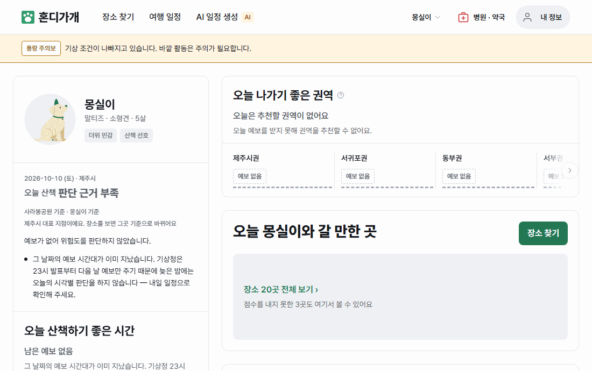

- **대표 반려견 기준**으로 오늘 산책해도 되는지 판단합니다. 견종 · 크기 · 더위 민감도 같은 프로필이 판단 조건으로 들어갑니다.
- **오늘 산책하기 좋은 시간**(골든타임) — 기상청 시간별 예보와 추정 노면(아스팔트) 온도로 계산합니다.
- **오늘 나가기 좋은 권역** — 제주시권 · 서귀포권 · 동부권 · 서부권 날씨를 비교해 권역을 추천합니다.
- **기상특보 띠** — 풍랑 · 호우 같은 특보가 있으면 화면 맨 위에 알립니다.
- **오늘 갈 만한 곳** — 적합도 점수가 높은 장소를 바로 보여 줍니다.

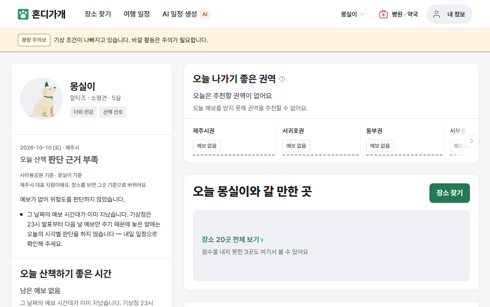

## 2. 장소 찾기 — 목록과 지도

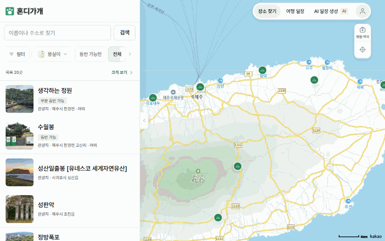

- **반려견 동반 가능 장소**를 유형(관광지 · 음식점 · 카페 · 숙박 · 문화시설 · 레포츠 …) · 지역 · 동반 조건으로 거릅니다. 목록은 커서 기반 무한 스크롤입니다.
- **반려견 칩**으로 함께 갈 아이를 바꾸면 체구(소형 · 중형 · 대형) 조건이 필터에 자동으로 반영됩니다.
- **지도 보기**(카카오 지도) — 카테고리 아이콘 핀, 고른 장소를 미리보기 패널로, "이 지역에서 재검색", 현재 위치, **병원 · 약국 함께 보기** 토글.
- 공공데이터(TourAPI · 한국문화정보원 · 식약처)를 미리 적재하고 원천 간 같은 장소를 병합해 보여 줍니다.

| 목록 | 지도 |
| --- | --- |
| 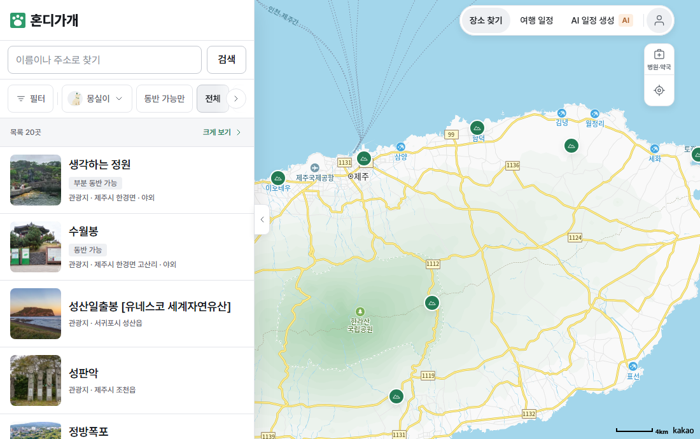 | 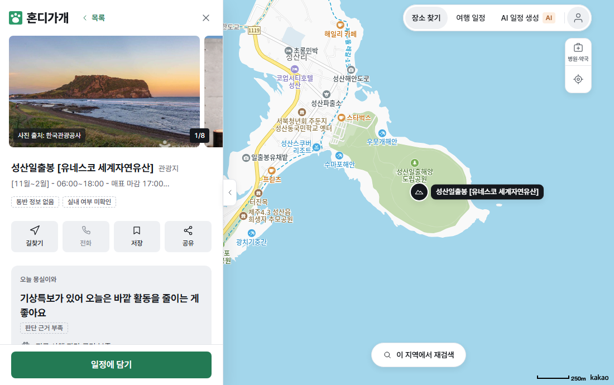 |

## 3. 장소 상세 — 이 아이와 가도 되는지

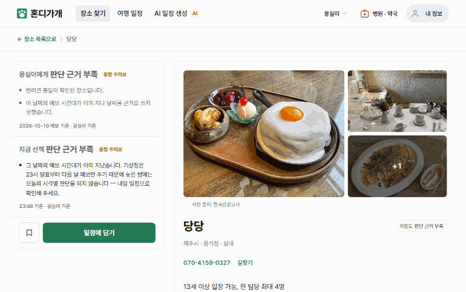

- **여행 적합도** — 날씨 · 동반 조건 · 혼잡도를 묶어 "이 아이(몽실이)에게" 등급과 근거를 보여 줍니다.
- **지금 산책 위험도** — 추정 노면 온도와 체감온도로 발바닥 화상 위험을 판단합니다.
- **기간 혼잡도** — 관광빅데이터 집중률 예측으로 한산한 날을 고를 수 있습니다.
- **반려견 동반 정보** — 입장 조건(크기 · 인원 · 목줄 등), 연락처 · 길찾기, 한국관광공사 사진.
- 하단 바에서 **찜(저장)** 하거나 **일정에 담기**(기존 일정의 원하는 날, 또는 새 일정)로 바로 넣습니다.

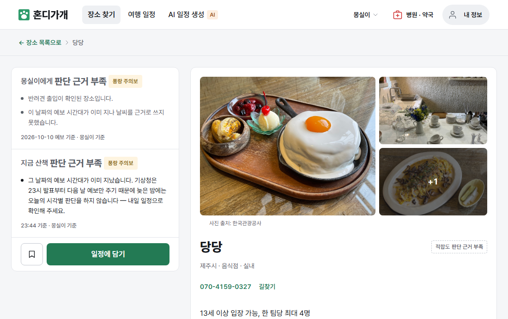

## 4. AI 일정 만들기

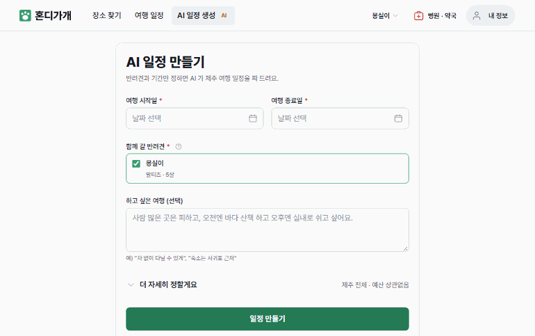

- **기간 · 함께 갈 반려견 · 하고 싶은 여행**(자유 문장)만 넣으면 일정을 짜 줍니다. 지역(시군구) · 예산 · 꼭 넣을 장소 · 찜한 곳 우선은 "더 자세히 정할게요"에서 고릅니다.
- 서버가 작업을 받아 **조건 확인 → 후보 장소 → 날씨 → 초안 작성** 단계를 실시간(SSE, 폴링 폴백)으로 보여 줍니다.
- LLM 은 사내 GPU 서버의 **Ollama(`gpt-oss:20b`)** 입니다. 서버가 반려견 동반 가능 후보를 **권역마다 골고루** 골라 주고, 여러 날이면 섬을 한 바퀴 도는 **일자별 권역 순서**를 제안합니다.
- 결과는 서버 사실로 한 번 더 검증합니다 — 후보에 없는 장소 제거, 같은 장소 반복 교체, 숙소 재배치(이동 거리 최소화), 마지막 날 숙소 제거.
- 초안은 바로 저장되지 않습니다. **"내 일정에 담기"** 를 눌러야 내 일정이 되고, 마음에 안 드는 날은 **하루만 다시 만들기** 할 수 있습니다.

| 조건 입력 | 초안 결과 |
| --- | --- |
| 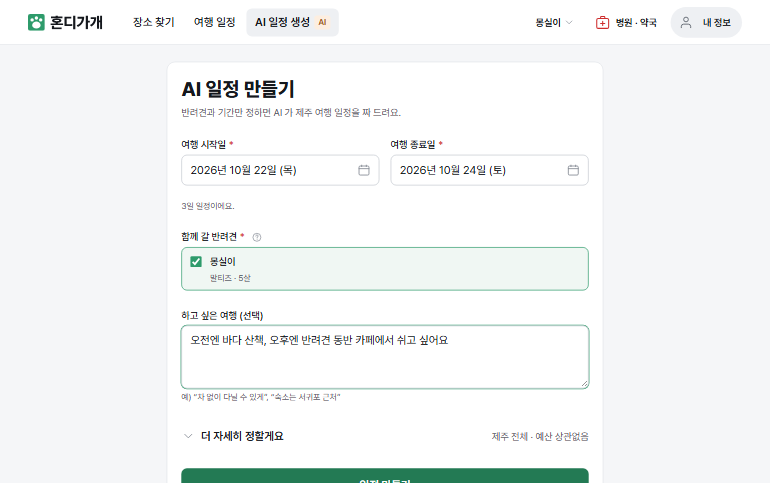 | 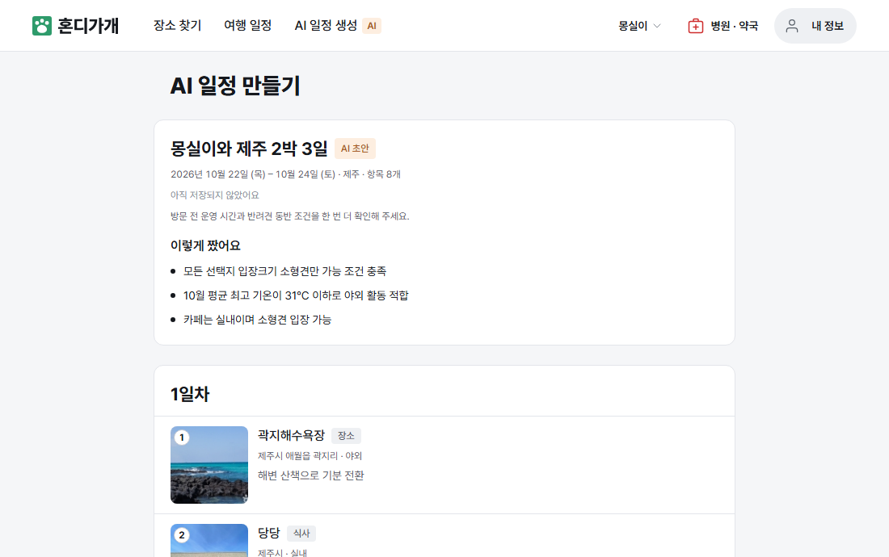 |

## 5. 여행 일정 — 동선 · 준비물 · 확정

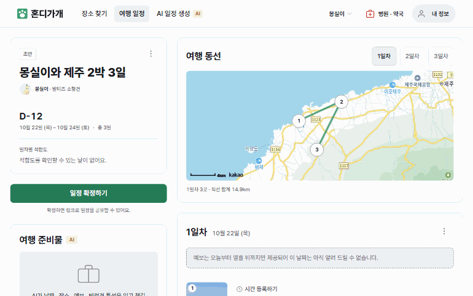

- **여행 동선** — 일자별 방문 순서를 지도에 선으로 잇고 직선 거리 합계를 보여 줍니다.
- **일자별 타임라인** — 장소 · 식사 · 숙소 항목, 시간 등록, 이동 · 휴식 추가. 날마다 예보와 비 오는 날 실내 대안을 함께 봅니다.
- **여행 준비물** — 날씨 · 장소 · 반려견 특성을 읽어 AI 가 준비물을 추천하고(서버 규칙 기반), 직접 추가 · 체크할 수 있습니다.
- **일정 확정 → 공유 링크** — 확정하면 링크로 일정을 공유할 수 있습니다(공개 경로는 레이트 리밋 · 로그 마스킹으로 보호).
- **여행 브리핑** — 출발 하루 전부터 그날의 날씨 · 동선 · 주의 사항을 한 화면에 모읍니다.

| 일정 상세 | 일정 목록 |
| --- | --- |
| 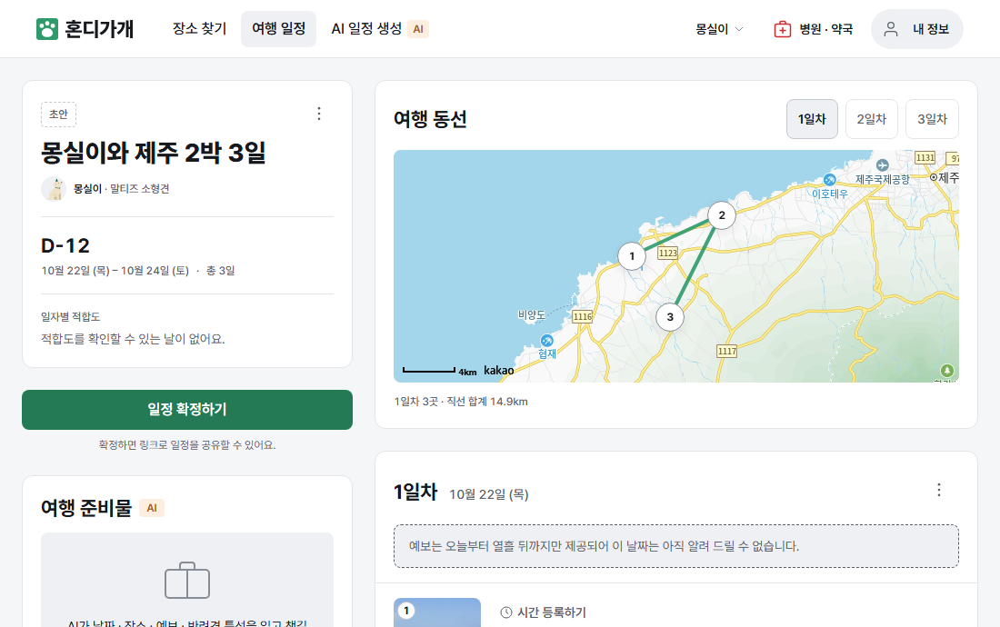 | 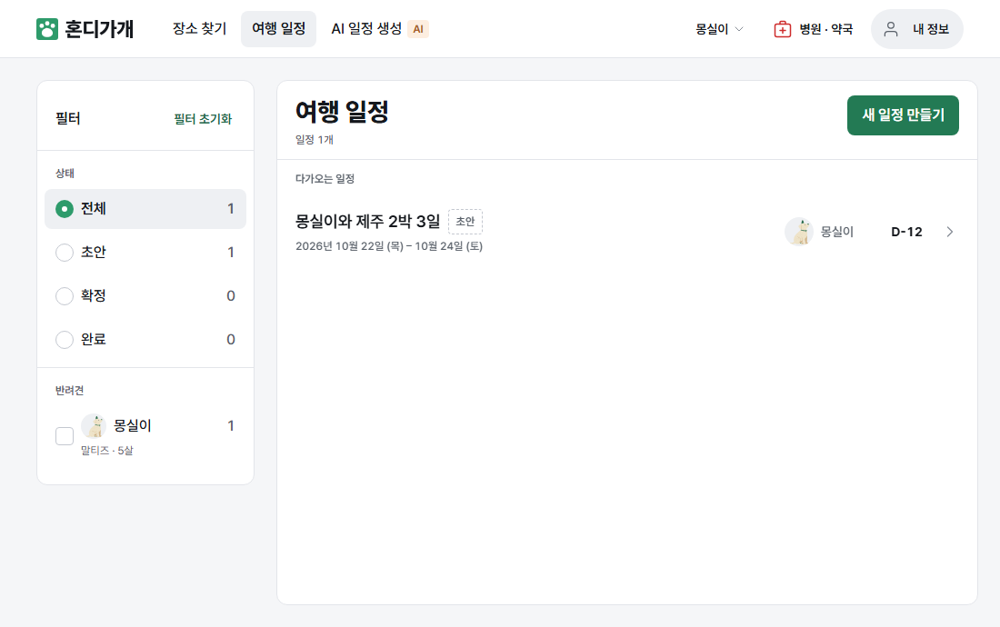 |

## 6. 병원 · 약국

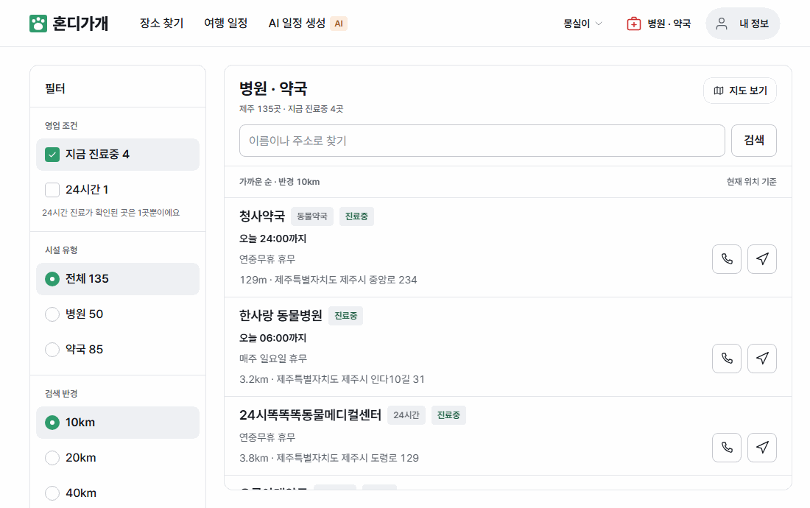

- 제주 **동물병원 · 동물약국 214곳**(한국문화정보원)을 현재 위치 기준 가까운 순으로 찾습니다.
- **지금 진료 중 · 24시간** 필터, 반경(10~50km) · 권역(제주시 · 서귀포 · 동부 · 서부) 선택, 전화 · 길찾기 바로가기, 지도 보기.
- 일정 상세에서도 그 여행 지역 근처의 병원 · 약국을 바로 볼 수 있습니다.

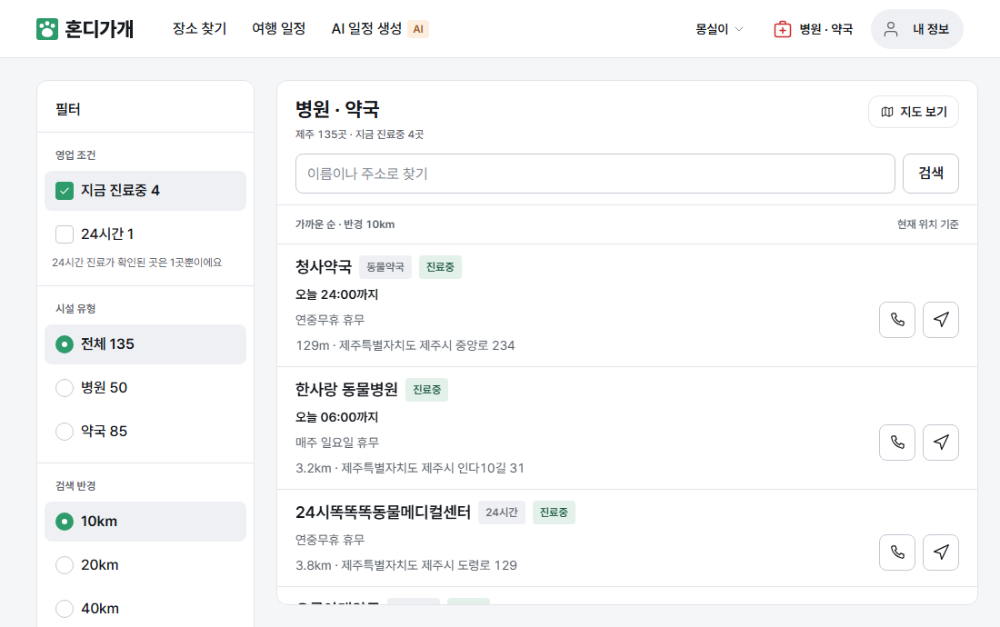

## 7. 제주올레 산책 코스

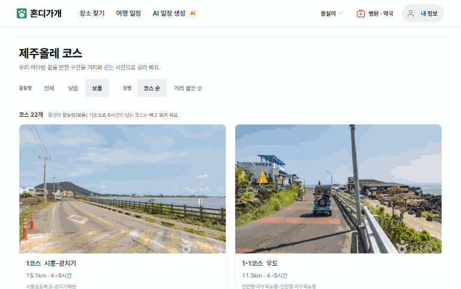

- **제주올레 29개 코스**(공공데이터포털 + TourAPI 좌표)를 난이도 · 거리 순으로 봅니다.
- 코스 상세 — 거리 · 걷는 시간 · 시종점, 반려견 활동량에 맞는지, **코스 시작점 지도**, 시작점 기준 **오늘 산책하기 좋은 시간**.
- **일정에 담기** 로 기존 일정이나 새 일정에 바로 넣습니다.

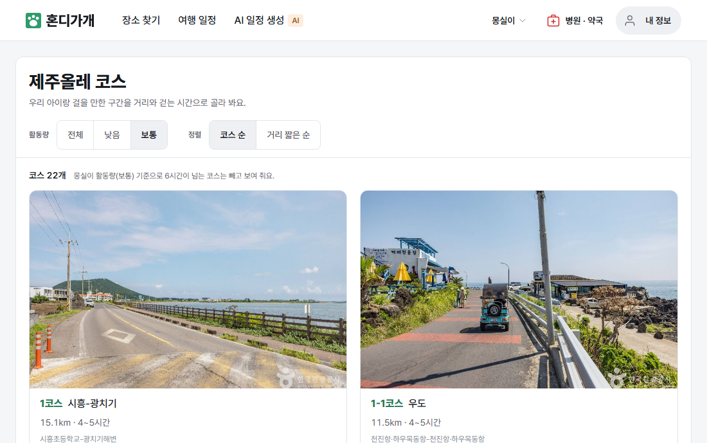

## 8. 반려견 프로필

- 최대 5마리까지 등록하고 **대표견**을 정합니다. 대표견이 홈 판단 · 장소 필터 · AI 일정의 기본 조건이 됩니다.
- 견종 · 생년월 · 체중 · 크기 · 활동량 · 사회성 · 더위/추위/소음 민감도 · 산책 선호를 기록합니다.
- 체중을 적으면 크기가 맞춰지고, 장소의 입장 체중 제한 안내에 쓰입니다.

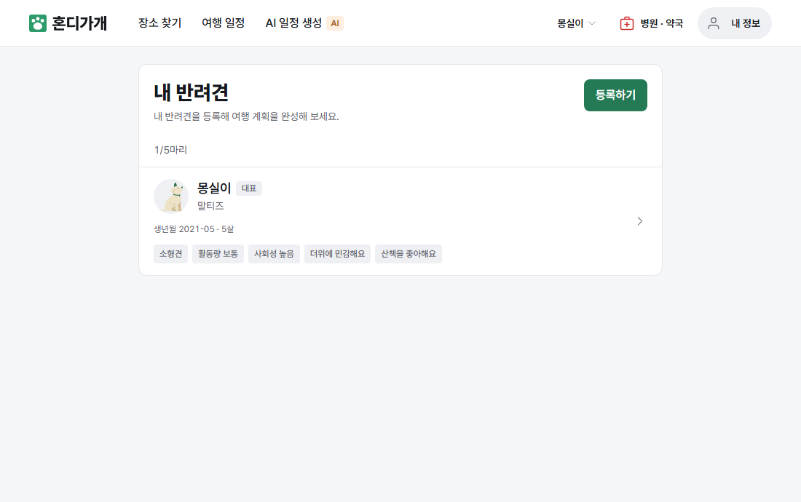

## 9. 모바일

| 지도 보기 (바텀 시트) | 홈 |
| --- | --- |
| 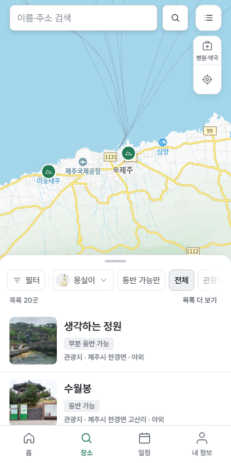 | 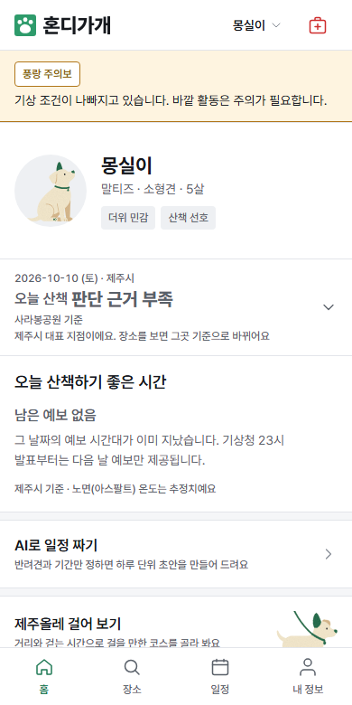 |

- 모바일은 하단 탭(홈 · 장소 · 일정 · 내 정보)과 끌어 올리는 목록 시트로 지도와 목록을 함께 씁니다.
- 지도 SDK 를 불러오지 못하면 안내 화면 대신 목록 보기로 옮기고 토스트로 알립니다.

## 10. 회원 · 서비스 소개

| 로그인 | 서비스 소개 |
| --- | --- |
| 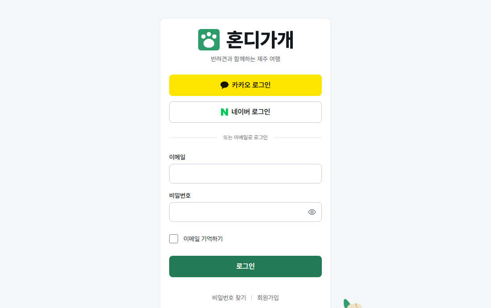 | 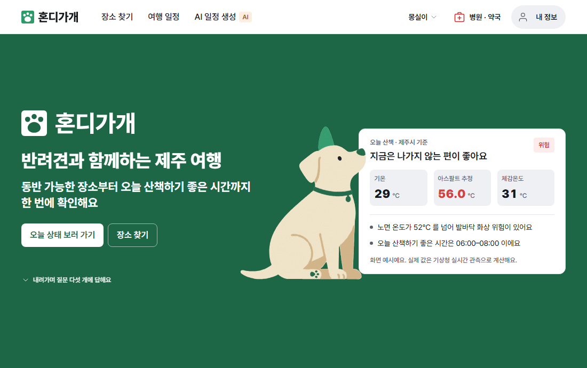 |

- 카카오 · 네이버 소셜 로그인과 이메일 회원가입(인증코드 · 약관 시트)을 지원합니다. 인증코드 발송은 만료 · 재발송 대기 시간을, 제한(429)에는 `Retry-After` 를 내려 줍니다.
- 내 정보에서 프로필 · 프로필 사진 · 비밀번호 · 회원 탈퇴를 관리합니다.

---

## 품질 점검 — dev E2E 탐색 결과 (2026-10-10)

이 문서의 캡처와 같은 Playwright 세션으로 dev 를 점검했습니다.

- **화면 15곳 순회** — 콘솔 오류 · 실패한 API(4xx/5xx) · 페이지 로드 중 같은 API 중복 호출 **0건**. 모바일(390px) 7개 화면 가로 넘침 0건.
- **따닥(빠른 두 번 클릭) 점검** — 상태를 바꾸는 주요 버튼을 더블클릭해 같은 요청이 몇 번 나가는지 셌습니다.

| 버튼 | 요청 | 결과 |
| --- | --- | --- |
| 로그인 | `POST /auth/login` | 1회 ✅ |
| 반려견 등록 | `POST /members/me/pets` | 1회 ✅ |
| 장소 찜 | `POST /favorites/places/{id}` | 1회 ✅ |
| 일정 만들기 | `POST /plans` | 1회 ✅ |
| 일정 확정 | `PUT /plans/{id}` | 1회 ✅ |
| AI 일정 만들기 | `POST /ai-plans` | 1회 ✅ |
| 내 정보 저장 | `PATCH /members/me` | 1회 ✅ |
| **AI로 준비물 챙기기** | `POST /ai-plans/packing-list/{planId}` | **2회 ❌** — 서버에서 LLM 도 두 번 돈다 → [#1338](https://github.com/8llow8llowMe/hondigagae/issues/1338) (FE) · [#1337](https://github.com/8llow8llowMe/hondigagae/issues/1337) (BE) |
| **일정에 담기**(장소 · 올레, 데스크톱) | 시트 열기 | **시트가 열리자마자 닫힘 ❌** → [#1339](https://github.com/8llow8llowMe/hondigagae/issues/1339) |
